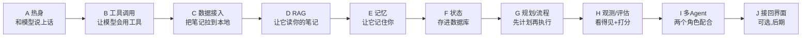

# Agent 入门闯关路线（Python 优先 · 小步快跑）

## 怎么用这份路线（先读这段）

- 全程用 **Python**，每个任务就是一个独立小脚本，终端里 `python xxx.py` 就能看到结果。现有的 TS/Next.js 聊天界面**先原样不动**，等你把概念玩熟了，最后一关再接回去。
- 每个任务 **15-30 分钟、只做一件事、必须有肉眼可见的结果**。做完这一个才做下一个，不贪多。
- 我讲理论只讲"够你做这一步的那几句"，剩下边做边懂。每关我会给你：要干嘛 → 直接能抄的代码骨架 → 跑出来该看到什么 → 卡住了怎么查。
- 所有练习脚本放在项目根目录，和你现有代码互不干扰。
- 复用你已有的两个服务：局域网的 Qwen（OpenAI 兼容接口）和本地 Notion MCP（`localhost:8000/mcp`）。

## 闯关地图

## A · 热身：先和你的模型说上话（对应 Tool Calling 前置）

- A1：`a1_talk.py` —— 用 `openai` 库连你的 Qwen，发一句"你好"，打印回复。目标：第一次跑通。
- A2：加一个 `while` 循环和 messages 列表，做成终端里能连续聊天的小程序。
- A3：开启流式（`stream=True`），让回复一个字一个字蹦出来。

## B · 工具调用：让模型学会"用工具"（对应 Tool Calling）

- B1：写个本地 Python 函数（如查当前时间/简单计算器），先**手动**把结果喂回模型，体会"工具"到底是什么。
- B2：用模型的 tools/function-calling 参数，让**模型自己决定**要不要调你的函数，你负责执行并回填。
- B3：用 Python 的 MCP 客户端连上 Notion MCP，把它提供的工具列表打印出来（看看你有哪些能力）。
- B4：让模型通过 MCP 工具真的去查一个 Notion 页面并回答。

## C · 数据接入：把 Notion 笔记拉到本地（对应 数据接入-离线同步）

- C1：写脚本拉取你的 Notion 页面列表，存成本地 `notes.json`。
- C2：把每页正文抽出来，做最简单的切块（比如按段落/固定长度），存本地。
- C3：记录每页的 `last_edited_time`，第二次运行只更新变化的页面（增量同步）。

## D · RAG：让它能"读你的笔记"回答（对应 RAG）

- D1：调用 embedding 接口把一句话转成向量，打印出来看看长啥样。
- D2：装 Chroma（本地向量库，几行代码），把 C 步的切块都存进去。
- D3：输入一个问题 → 检索出最相关的几块 → 打印它们。
- D4：把检索到的内容拼进 prompt，让模型基于你的真实笔记回答，并带上出处。

## E · 记忆：让它记住你（对应 Memory）

- E1：长对话自动摘要压缩（把一长串历史压成一小段，省上下文）。
- E2：从对话里抽取"关于你的事实"（在学什么、有哪些项目）存 `memory.json`，新会话开场自动读回来。

## F · 状态管理：存进数据库（对应 状态管理/持久化）

- F1：用 SQLite 把对话消息存下来，脚本重启后还能把历史读回来。

## G · 规划与流程：先计划再执行（对应 Planner + Workflow）

- G1：让模型先输出一份"步骤计划"，再一步步执行（plan-and-execute 最小版）。
- G2：写一个固定流程脚本：拉笔记 → 摘要 → 写回 Notion（体会"确定性 workflow"，写操作前先打印预览再确认）。

## H · 观测与评估：看得见 + 能打分（对应 可观测性 + 评估，你之前漏的那块）

- H1：给脚本加简单的日志、计时、token 数打印，看清每次调用花了多少。
- H2：写一个 5-10 条问答的小评估脚本，给 RAG 回答自动打分，改代码前后跑一次做对比。

## I · 多 Agent：两个角色配合（对应 多 Agent 协作）

- I1：写两个"角色"（检索员 + 写作员），让它们配合完成一个任务（如"根据我的笔记写一段周报"）。

## J · 接回界面（可选，放最后）

- J1：等前面都熟了，用 FastAPI 把你的 Python 逻辑暴露成一个接口，再让现有 Next.js 聊天界面调用它，把学到的东西真正用起来。

## 依赖（每关用到再装，不用一次装全）

- 起步只需：`openai`（或 `requests`）。
- 后面按关卡加：`mcp`（MCP 客户端）、`chromadb`（向量库）、`notion-client`（可选，直连 Notion API）、`fastapi` + `uvicorn`（最后一关）。

## 我作为带你学的人怎么配合

- 一次只带你打一关：给你能直接抄的代码骨架 + "跑出来该看到什么" + 卡住的排查点。
- 每关跑通后我用一两句话点一下"这关背后的概念是什么、对应岗位哪个能力"，不长篇大论。
- 你说"下一关"我们才继续，随时可以停。