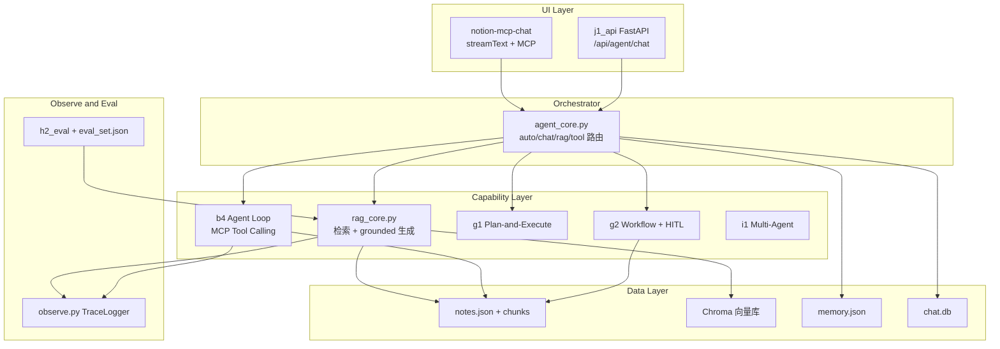

# Personal Knowledge Agent 架构

## 五层架构图



## 模块职责

| 模块 | 职责 | 不应做 |
|------|------|--------|
| `agent_core.py` | 路由、组合能力 | 不直接操作 Chroma/MCP 细节 |
| `rag_core.py` | 检索 + 生成 | 不做 Tool 调用 |
| `memory_store.py` | 长期事实读写 | 不存会话消息（那是 f1） |
| `observe.py` | Trace 收集 | 不做业务逻辑 |
| `pipeline.py` | chunk + 入库 | 不做 LLM 调用 |
| `mcp_helper.py` | MCP 同步封装 | 不做 Agent Loop |

## 数据流

### RAG 读路径

```
c1 sync → c2 chunk → d2 chroma → d3/d4 retrieve → LLM answer
```

### Tool 实时路径

```
User → LLM + tools → MCP call_tool → 回填 → loop → answer
```

### 写路径（安全）

```
g2: load notes → summarize → preview → HITL confirm → MCP write
```

## 与 notion-mcp-chat 的关系

| 组件 | personal-agent (Python) | notion-mcp-chat (TS) |
|------|-------------------------|----------------------|
| Agent Loop | b4 / agent_core | route.tsx streamText |
| RAG | d4 / rag_core | 未集成（可选对接 j1_api） |
| Memory | memory_store | 未集成 |
| MCP | mcp_helper / b4 | app/lib/mcp.tsx |

整合路径：Next.js fetch `localhost:8010/api/agent/chat?mode=rag`
