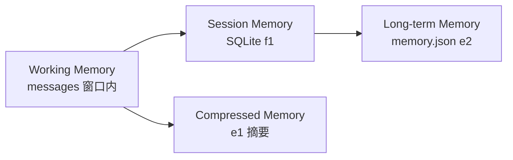

# 阶段 3 · Memory 与 State 分层

## Memory 四层模型



| 层级 | 实现 | 存什么 | 生命周期 |
|------|------|--------|----------|
| Working Memory | `messages` 列表 | 当前对话上下文 | 单次请求 / 会话内 |
| Session Memory | [`f1_sqlite.py`](../f1_sqlite.py) | 历史消息 | 跨重启，按 conversation_id |
| Compressed Memory | [`e1_summary.py`](../e1_summary.py) | 长对话摘要 | token 超阈值时生成 |
| Long-term Memory | [`memory_store.py`](../memory_store.py) | 用户事实画像 | 跨会话，退出时更新 |

## Memory vs State vs RAG

| 概念 | 语义 | 工程 |
|------|------|------|
| **Memory** | 记什么（用户事实、摘要） | memory.json、e1 输出 |
| **State** | 存哪（会话、消息序列） | SQLite chat.db |
| **RAG** | 外部知识（笔记内容） | Chroma 向量库 |

**面试金句：** RAG 回答「笔记里写了什么」；Memory 回答「用户是谁、在做什么」。

## 跨会话注入

[`memory_store.build_memory_system_prompt()`](../memory_store.py) 在新会话启动时把 `data/memory.json` 注入 system prompt。

已集成到：
- [`e2_memory.py`](../e2_memory.py) — 交互式长期记忆
- [`f1_sqlite.py`](../f1_sqlite.py) — SQLite 会话 + 记忆注入
- [`agent_core.py`](../agent_core.py) — chat/rag/tool 路径均注入

## 示例 memory.json

```json
[
  "用户正在学习 AI Agent，重点包括 RAG、Memory、Planning 和 Tool Calling",
  "用户在做 personal-agent 和 notion-mcp-chat 项目"
]
```

## 什么时候摘要 vs 抽事实

| 触发 | 动作 | 脚本 |
|------|------|------|
| 对话太长、接近 context 上限 | 压缩历史为摘要 | e1 |
| 用户退出会话 | 抽取用户事实写入 memory.json | e2 |
| 每次新消息 | 从 SQLite 加载历史 | f1 |

## 验收自检

- [ ] 能区分 Memory（语义）vs State（工程）
- [ ] 能画四层 Memory 图
- [ ] f1 或 e2 二次启动能「记得」用户事实

## 跑通命令

```bash
python e2_memory.py    # 聊几句后 quit，更新 memory.json
python f1_sqlite.py    # 新会话也能看到 memory 注入
```
