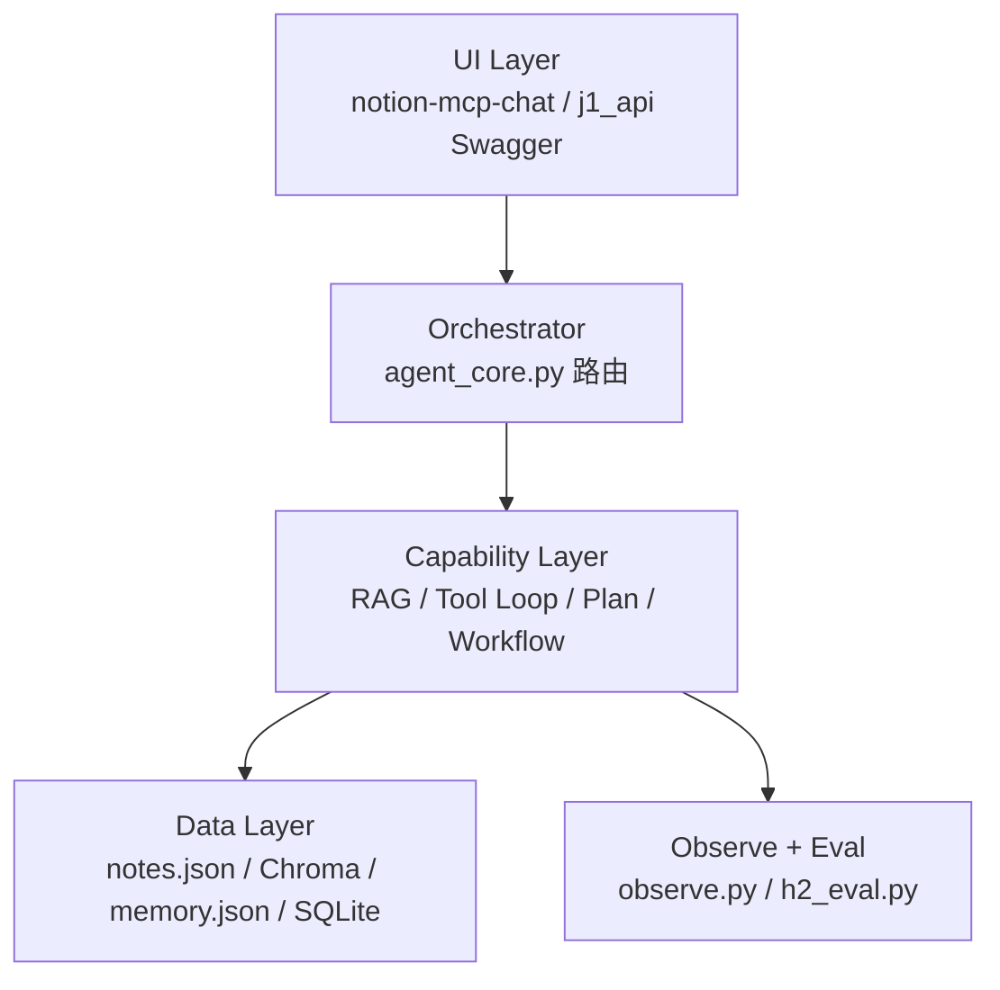

# 阶段 6 · 架构与面试叙事

## 项目定位（一句话）

> **Personal Knowledge Agent**：基于个人笔记（Notion + 本地 Chroma）的可 grounded 问答 Agent，具备 Tool 实时查询、分层 Memory、确定性 Workflow 写回，以及 eval 驱动的 RAG 调优。

## 五层架构



## 请求走查示例

**用户问：「我最近在学什么？」**

1. UI → `POST /api/agent/chat` mode=auto
2. Orchestrator → `detect_route` → **rag**
3. rag_core → Chroma retrieve top_k=3 → LLM grounded 生成
4. memory_store → system prompt 注入用户事实
5. observe → trace 2 steps, 返回 answer + sources + trace

**用户问：「搜索 Notion 最新笔记」**

1. route → **tool**
2. agent_core → MCP Agent Loop（max 5 steps）
3. trace 记录每步 tool 调用

## 2 分钟口述稿（STAR）

**S（背景）：** 个人笔记在 Notion，纯聊天无法基于真实内容回答，还会幻觉。

**T（任务）：** 做 Personal Knowledge Agent——能读笔记、记住用户、安全写回。

**A（行动）：**
- 读：离线 sync + RAG（快、可 eval）
- 实时查：MCP Tool Agent Loop
- 写：G2 Workflow + HITL
- Memory 四层：messages / SQLite / 摘要 / memory.json
- 用 20 条 eval 集调 chunk 和 top_k

**R（结果）：** eval 平均分 X；tool loop trace 可展示 3 步；写操作 100% 经确认。

## 5 分钟深度版（加这些点）

1. **b4 vs route.tsx**：同一 Loop，Python 教学 vs AI SDK 生产
2. **RAG vs Tool 取舍**：批量读走 RAG，实时走 MCP
3. **Plan vs Workflow**：g1 开放任务 vs g2 写回 HITL
4. **Eval 驱动**：run_experiments 对比 chunk/top_k
5. **为什么没上 LangGraph**：当前路由 + Workflow 够用，手写 Loop 证明理解底层

## 常见面试题速查

见 [`interview_qa.md`](interview_qa.md)

## API 演示

```bash
uvicorn j1_api:app --reload --port 8010
# 打开 http://localhost:8010/docs
# POST /api/agent/chat  {"message": "什么是 RAG", "mode": "rag"}
```

## 最终交付物清单

- [x] 架构图 — 本文 + [`architecture.md`](architecture.md)
- [x] Eval 集 — `data/eval_set.json`（20 条）
- [x] 报告模板 — `docs/reports/`（跑 h2_eval / run_experiments 生成）
- [x] 设计文档 — stage0–5 docs
- [x] agent_core + j1_api — 统一编排入口
- [ ] 口述稿 — 填入你的真实 eval 分数后练 2 遍

## 与 LangGraph 的回应话术

> 「LangGraph 适合复杂状态机和多分支图。我的场景路由清晰：问答走 RAG、实时查走 Tool、写走 Workflow。先用 Python 手写 Loop 理解每一步，需要更复杂分支时再引入框架——我知道框架在封装什么。」
